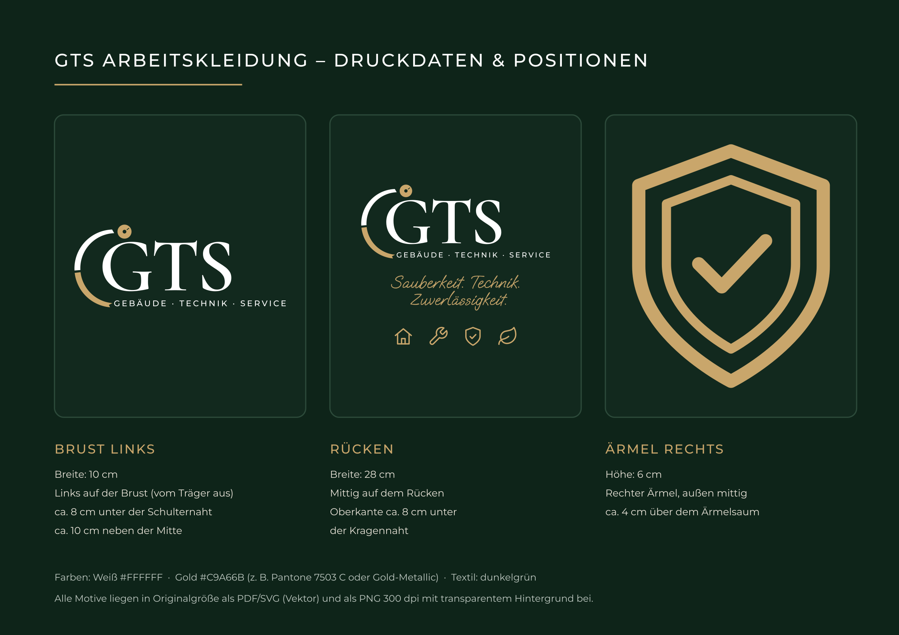

# GTS Arbeitskleidung – Druckdaten

## Diese Dateien an die Textildruckerei schicken

| Motiv | Größe | Dateien |
|---|---|---|
| Brust links (Logo) | 10 cm breit | `GTS_Shirt_Brust-links_100mm.pdf` / `.svg` / `_300dpi.png` |
| Rücken (Logo, Slogan, Icons) | 28 cm breit | `GTS_Shirt_Ruecken_280mm.pdf` / `.svg` / `_300dpi.png` |
| Ärmel rechts (Schild) | 6 cm hoch | `GTS_Shirt_Aermel-rechts_60mm.pdf` / `.svg` / `_300dpi.png` |
| Positionierungsplan | A4 | `GTS_Arbeitskleidung_Positionierungsplan.pdf` |

- **PDF/SVG** sind Vektordateien in Originalgröße (1:1). Das ist ideal für Siebdruck, Flex/Flock und Stickerei.
- **PNG** hat 300 dpi und einen transparenten Hintergrund, passend für DTF-/Digitaldruck.
- **Farben:** Weiß `#FFFFFF` und Gold `#C9A66B` (z. B. Pantone 7503 C oder ein Gold-Metallic-Ton). Alle Farben sind Vollton, es gibt keine Verläufe.

## Was die Druckerei zusätzlich von euch wissen muss

1. **Textil:** Modell/Marke und Farbe (dunkelgrün, z. B. „Bottle Green“ oder „Forest Green“)
2. **Stückzahl pro Größe** (z. B. 2× M, 3× L, 2× XL)
3. **Veredelung:** Druck (DTF/Siebdruck) oder Stick
4. **Liefertermin**

Beim **Stick** ist der kleine Schriftzug „GEBÄUDE · TECHNIK · SERVICE“ auf dem 10-cm-Brustlogo sehr fein. Bei Stick lieber 11–12 cm Breite wählen oder die Druckerei fragen.
