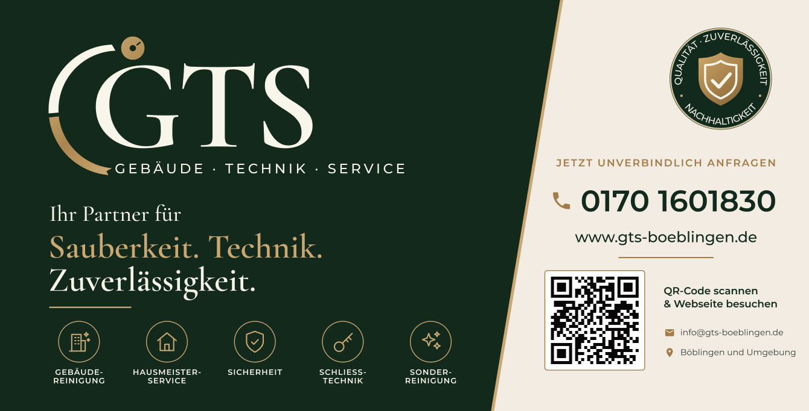
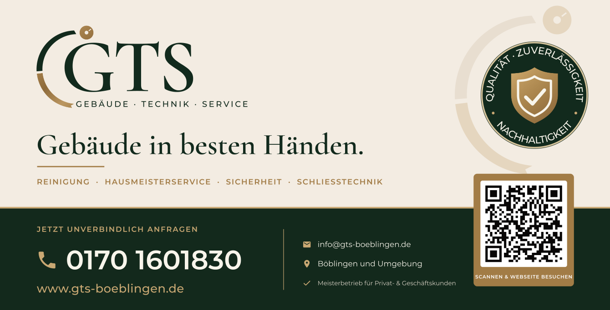

# GTS Bauzaunbanner

**Diese Datei an die Druckerei schicken:** `GTS_Bauzaunbanner_340x173cm.pdf`

- **Endformat 340 × 173 cm** (Standard-Banner für ein Bauzaunelement 3,50 × 2,00 m)
- Datei im **Maßstab 1:1**, 342 × 175 cm inkl. **1 cm Beschnitt** rundum (TrimBox/BleedBox gesetzt)
- **Reine Vektorgrafik** (keine Fotos) – gestochen scharf in jeder Größe
- **CMYK**, Schriften in Kurven, keine Transparenzen
- Alle Inhalte mindestens **5 cm vom Rand** entfernt (Platz für Saum und Ösen)
- QR-Code (42 × 42 cm) führt auf https://www.gts-boeblingen.de (automatisch geprüft)

Bei der Bestellung angeben: **Mesh-Plane** (winddurchlässig, empfohlen für Bauzäune),
**Saum rundum mit Ösen alle ca. 50 cm**, einseitig bedruckt.

## Entwurf 2 (separate Datei)

`GTS_Bauzaunbanner_Entwurf2_340x173cm.pdf` – gleiche technische Daten wie oben.
Heller und ruhiger: großes Logo, Claim „Gebäude in besten Händen.“, durchgehende Kontaktleiste mit
großer Telefonnummer, QR-Code 48 × 48 cm mit höchster Fehlerkorrektur (H, 30 %) für die Mesh-Plane.

## Entwurf 3 – nur Logo + QR-Code (separate Datei)

`GTS_Bauzaunbanner_Entwurf3_340x173cm.pdf` – gleiche technische Daten wie oben.
Logo mit Schriftzug „Gebäude · Technik · Service“ (175 cm breit) und QR-Code 88 × 88 cm
(Fehlerkorrektur H) auf Dunkelgrün.
