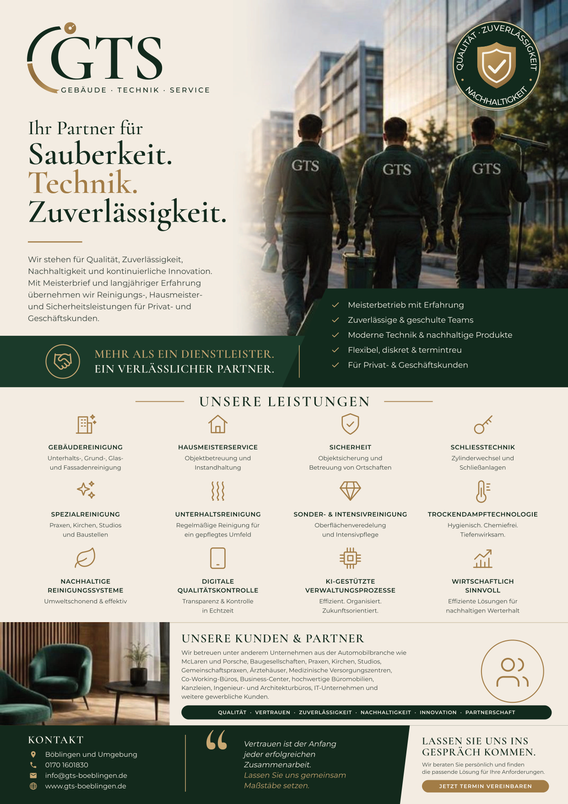

# GTS Flyer A4 – Druckdaten

**Diese Datei an die Druckerei schicken:** `GTS_Flyer_A4.pdf`

- Endformat **DIN A4 (210 × 297 mm)**, einseitig
- Datenformat 216 × 303 mm = **3 mm Beschnitt** rundum (TrimBox/BleedBox gesetzt, keine Schnittmarken)
- **CMYK**, Schriften in Kurven, keine Transparenzen, max. Farbauftrag ca. 298 %
- Empfehlung: 170–250 g/m² Bilderdruck matt

Hinweis: Die beiden Fotos (Team, Lounge) stammen aus dem Mockup-Bild und haben daher nur ca. 130 dpi.
Im Druck wirken sie etwas weich. Mit den Originalfotos in hoher Auflösung lässt sich das verbessern.
Das Skript dazu liegt in `visitenkarte-gts/quelle/flyer.py`.
