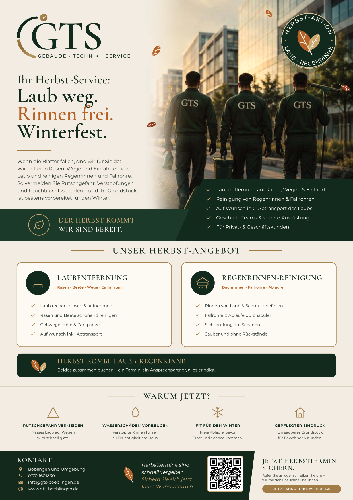
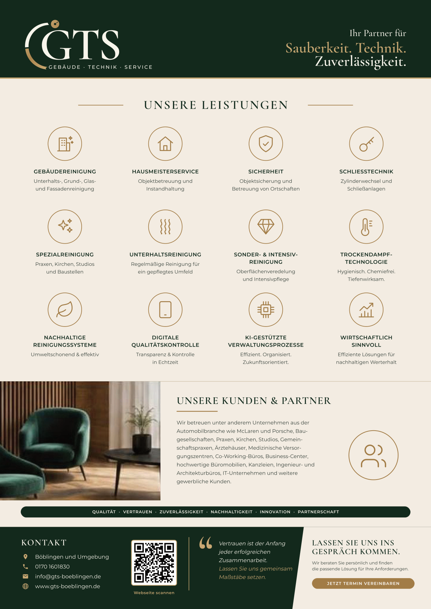

# GTS Herbst-Flyer A4 – beidseitig

| Seite 1 (vorne) | Seite 2 (hinten) |
|---|---|
|  |  |

**Diese Datei an die Druckerei schicken:** `GTS_Herbst-Flyer_A4_beidseitig.pdf`
(Seite 1 = Herbst-Angebot, Seite 2 = Leistungen, Kunden & Kontakt)

- Endformat **DIN A4 (210 × 297 mm)**, **beidseitig** (4/4-farbig), **3 mm Beschnitt** rundum
- **CMYK**, Schriften in Kurven, keine Transparenzen, max. Farbauftrag ca. 298 %
- QR-Codes auf beiden Seiten führen auf https://www.gts-boeblingen.de (automatisch geprüft)

Bitte vor dem Druck prüfen: Es sind keine Preise angegeben, und die Leistungspunkte des Herbst-Angebots
sollten zum tatsächlichen Angebot passen. Skripte: `visitenkarte-gts/quelle/herbst.py`, `herbst2.py`
