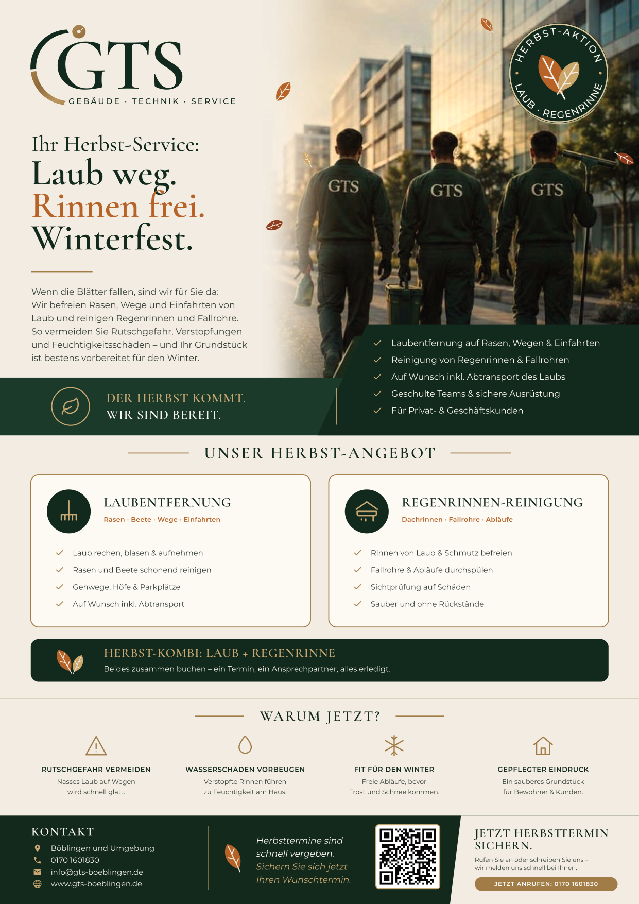

# GTS Herbst-Flyer A4 – Laubentfernung & Regenrinnenreinigung

**Diese Datei an die Druckerei schicken:** `GTS_Herbst-Flyer_A4.pdf`

- Endformat **DIN A4 (210 × 297 mm)**, einseitig, **3 mm Beschnitt** rundum (TrimBox/BleedBox gesetzt)
- **CMYK**, Schriften in Kurven, keine Transparenzen, max. Farbauftrag ca. 297 %
- QR-Code im Fußbereich führt auf https://www.gts-boeblingen.de (automatisch geprüft)

Bitte vor dem Druck prüfen: Es sind keine Preise angegeben, und die Leistungspunkte
(z. B. „Auf Wunsch inkl. Abtransport“, „Sichtprüfung auf Schäden“) sollten zum tatsächlichen Angebot passen.
Skript: `visitenkarte-gts/quelle/herbst.py`
