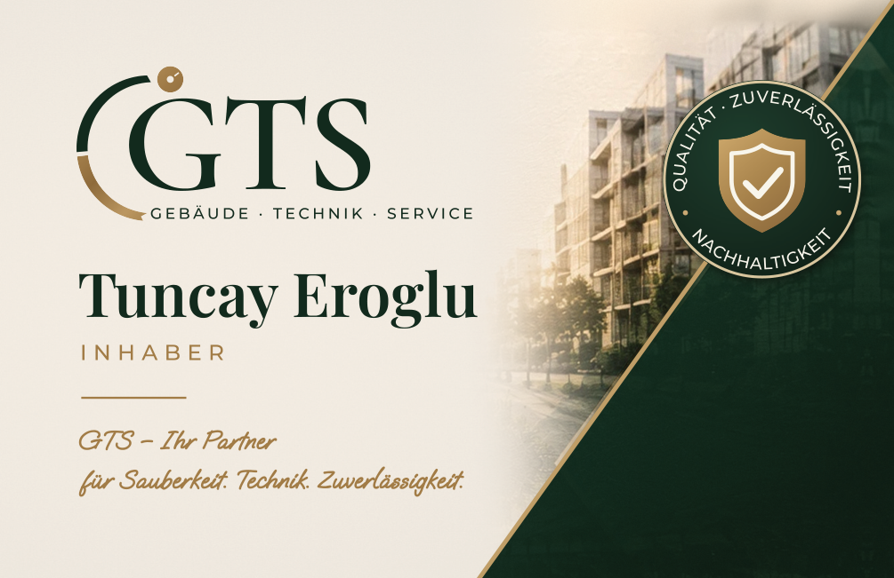
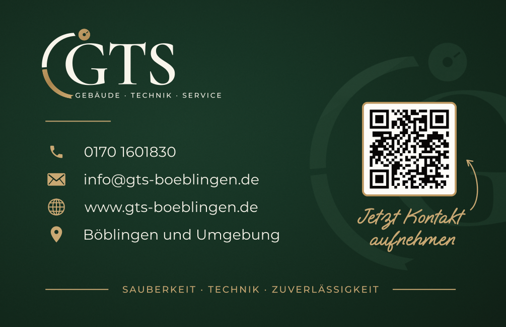

# GTS Visitenkarte – Druckdaten

Visitenkarte für **Tuncay Eroglu, GTS Gebäude · Technik · Service**, nachgebaut nach dem freigegebenen Mockup.

| Vorderseite | Rückseite |
|---|---|
|  |  |

## Diese Dateien bei der Druckerei abgeben

| Datei | Inhalt |
|---|---|
| `druckdaten/GTS_Visitenkarte_Vorderseite.pdf` | Vorderseite |
| `druckdaten/GTS_Visitenkarte_Rueckseite.pdf` | Rückseite |
| `druckdaten/GTS_Visitenkarte_Vorder-und-Rueckseite.pdf` | beide Seiten in einer Datei (Seite 1 = vorne, Seite 2 = hinten). Das ist praktisch, falls die Druckerei nur eine Datei möchte. |

## Technische Daten (für die Druckerei)

- **Endformat:** 85 × 55 mm (Standard-Visitenkarte)
- **Datenformat:** 91 × 61 mm, also **3 mm Beschnitt** rundum; TrimBox und BleedBox sind gesetzt, **keine Schnittmarken**
- **Farbraum:** CMYK; der Gesamtfarbauftrag liegt bei maximal ca. 295 %
- **Bilder:** 400 dpi
- **Schriften:** alle in Pfade/Kurven umgewandelt, es ist keine Schrift eingebettet
- **Transparenzen:** keine
- **Sicherheitsabstand:** alle Texte und Logos liegen mindestens 3 mm innerhalb des Endformats
- **Farbe:** Die Konvertierung erfolgte mit einem Standard-CMYK-Profil. Wenn die Druckerei ein bestimmtes Profil verlangt (z. B. FOGRA39/51), kann sie die Daten problemlos darauf anpassen.

Empfehlung: 350–400 g/m² Bilderdruck matt. Optional sehen Soft-Touch-Folie oder Gold-Heißfolie auf Logo und Linien sehr edel aus.

## QR-Code

Der QR-Code auf der Rückseite führt direkt auf **https://www.gts-boeblingen.de**. Das wurde mit dem fertigen PDF automatisch geprüft. Er ist 13,3 mm groß, hat Fehlerkorrektur Q (25 %) und einen weißen Ruhebereich, damit er zuverlässig scannt.

## Unterschiede zum Mockup-Bild

- Im Mockup ist die Karte etwa 2:1 proportioniert. Gedruckt wird im echten Format 85 × 55 mm, deshalb wurden die Elemente in der Höhe etwas luftiger verteilt.
- Der QR-Code ist größer als im Mockup, damit Handys ihn sicher erkennen.
- Die goldene Diagonale läuft exakt in die obere rechte Ecke. Das Siegel hält 3 mm Abstand zum Rand, damit es beim Schneiden nicht angeschnitten wird.
- Das Gebäudefoto stammt aus dem Mockup: Es wurde entzerrt und retuschiert, und das Siegel darunter wurde entfernt. Wer ein Originalfoto in hoher Auflösung hat, kann es einsetzen lassen, dann wird das Foto noch schärfer.

## Neu erzeugen / ändern

Im Ordner `quelle/` liegen die Skripte, mit denen die Karte erzeugt wurde. Texte wie Telefonnummer oder Name stehen in `quelle/build.py`. Mit `quelle/build.sh` (Python 3, Ghostscript) werden Druckdaten und Vorschaubilder neu erstellt.
